<h1 align="center">
  Hey there! 👋
</h1>

  I'm a passionate developer/student learning new things and building cool projects.
   
  (Update this text to be about YOU!)

  
  
  
  

  

---

### 🛠️ Languages

  

### Tools

  

---

### 📊 My GitHub Stats

---

### 🏆 GitHub Trophies

  

---

### 📈 My Contribution Graph

  

