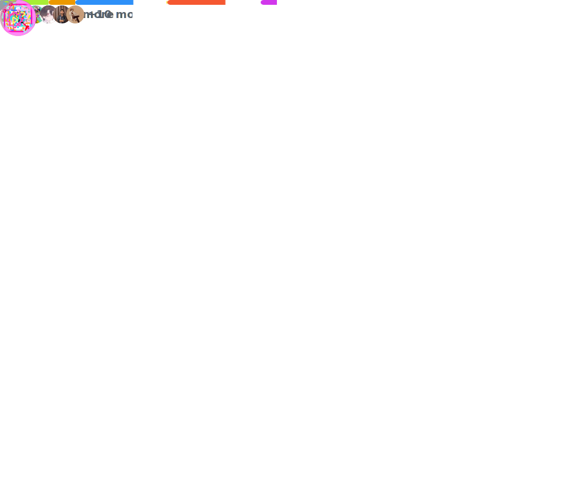

   &nbsp;&nbsp; &nbsp;&nbsp;&nbsp;<a href="https://github.com/ArpanHait">
    
  </a> &nbsp;&nbsp;&nbsp;&nbsp;&nbsp;

---

 🎖️🎗️🎖️

I am a student passionate about the intersection of software development and artificial intelligence. My focus is on learning and applying AI/ML concepts, with a particular fascination for the development of AI agents. I am actively expanding my skills through personal projects and as an enthusiastic contributor to the open-source community.

## 
⚙️ Languages & Tools ⚙️

  

##

  

---

### 📊 My GitHub Stats

##
### 
🚀 Live Projects 🚀

Check out my deployed projects and applications!

  
| Project | Details | Tech Stack | Live Demo |
|---------|---------|------------|-----------|
| **Autocorrect Tool** | [View README](https://github.com/ArpanHait/AUTOCORRECT_TOOL/blob/master/README.md) | `HTML` `CSS` `JavaScript` `API` | [🔗 Live Demo](https://arpcorrect.netlify.app) |
| **AI Agentic RAG** | [View README](https://github.com/ArpanHait/AGENTIC_RAG/blob/main/README.md) | `Python` `API` `Streamlit` | [🔗 Live Demo](https://arpanagent.streamlit.app/) |
| **TO_DO Task Manager** | [View README](https://github.com/ArpanHait/TO_DO/blob/main/README.md) | `Python` `Django` `SQLite` `HTML` `CSS` `Javascript`  | [🔗 Live Demo](https://to-do-01m0.onrender.com) | 
| **Working..** | [View README](https://github.com/ArpanHait/DEEPFAKE_DETECTION/blob/main/README.md) | `Pytorch` `CNN` `ReactJS` `Vite5` `TailwindCSS` | [🔗 Live Demo](https://to-do-01m0.onrender.com) | 

---
### 📈 My Contribution Graph

  

##
### 🖥️ Hacktoberfest Stats

---
### 
🔗 Connect with me 

  
  
  
  
  
  
  

